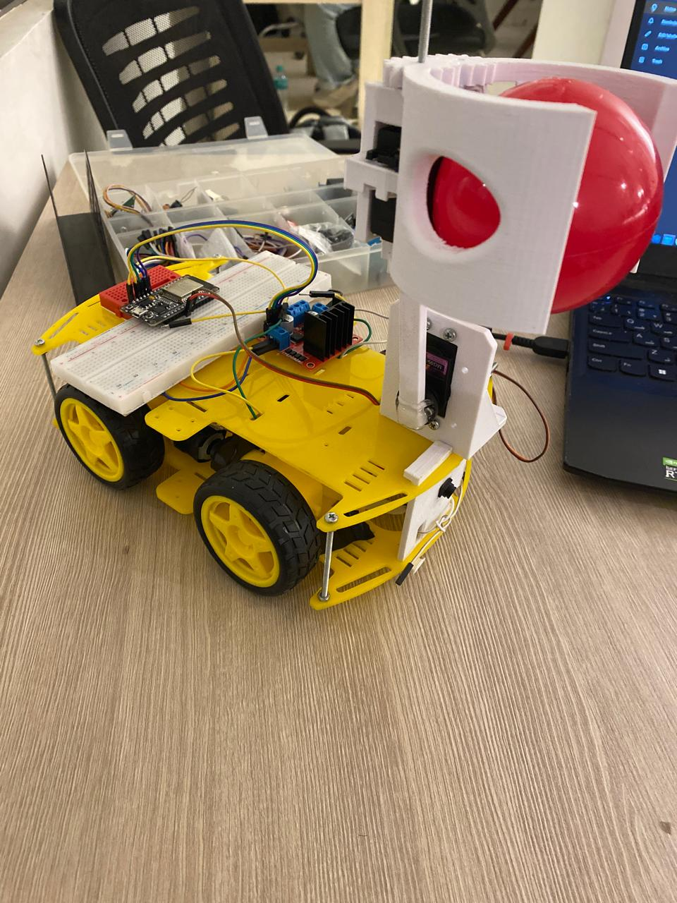
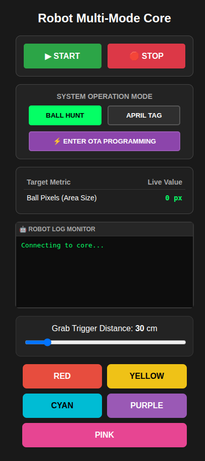
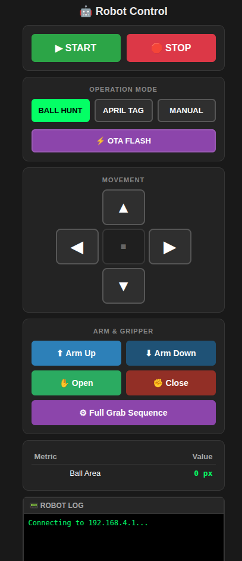

# 🤖 Autonomous Pick-and-Place Robot using ESP32 & ESP32-CAM



An autonomous mobile robot capable of detecting, tracking, grasping, and delivering a user-selected colored object using computer vision and embedded systems.

The project combines real-time image processing, autonomous navigation, robotic manipulation, wireless communication, and embedded firmware into a single integrated system.

---

# ✨ Features

- 🎥 Real-time color detection using ESP32-CAM
- 🎯 Autonomous object tracking
- 🦾 Two-DOF robotic arm with servo-actuated gripper
- 🚗 Autonomous navigation toward the detected object
- 🌐 Built-in Wi-Fi dashboard for configuration and manual control
- 📡 UART communication between ESP32-CAM and ESP32
- 🔄 OTA (Over-the-Air) firmware updates
- ⚡ ROI-based vision optimization for improved responsiveness
- 🏷️ AprilTag localization prototype for autonomous delivery

---

# 📷 Project Overview

The robot detects a user-selected colored ball, aligns itself with the target, approaches it autonomously, grips it using a robotic arm, and was designed to transition to AprilTag-based localization for autonomous delivery.

The system was developed as part of the Project-Based Learning (PBL) course at Egypt-Japan University of Science and Technology (E-JUST).

---

# 🏗️ System Architecture

ESP32-CAM
- Captures camera frames
- Performs color detection
- Executes ROI tracking
- Sends movement commands through UART

↓

ESP32

- Controls DC motors
- Controls robotic arm servos
- Hosts Wi-Fi dashboard
- Executes gripping sequence
- Supports OTA firmware updates

---

# ⚙️ Hardware

- ESP32
- ESP32-CAM
- 2 Servo Motors
- 4 DC Motors
- LM2596HVS DC-DC Buck converter Step Down Module
- 3 li-ion batteries
- L298 Motor Driver Module
- Mobile Robot Chassis
- Robotic Gripper
- ESP32-CAM Mount
- Custom Arm Link

---

# 💻 Software

- PlatformIO
- Visual Studio Code
- C++
- Arduino Framework
- OpenCV (Desktop AprilTag Prototype)

---

# 🚀 Performance Optimizations

Instead of processing every pixel in every frame, the vision system uses an adaptive Region of Interest (ROI) tracking algorithm.

When the object is detected:

- Only a small region surrounding the object is processed.

When tracking is temporarily lost:

- The algorithm searches around the previous object position for several frames before expanding the search area.

When no object is detected:

- The camera scans image borders while periodically performing a full-frame search.

The ESP32-CAM operates using QQVGA resolution to reduce computational load while maintaining reliable detection accuracy.

---

# 🌐 Web Dashboard

The ESP32 hosts a built-in web interface allowing users to:

- Select the target color
- Configure gripping distance
- Manually drive the robot
- Monitor robot status

No additional application is required.

> autonomous website

> Manual website

---

# 🔄 OTA Updates

Both ESP32 boards support Over-the-Air firmware updates, allowing rapid development without physically reconnecting programming cables after assembly.

---

# 📁 Repository Structure

```
src/
    espcam/
    motor_esp/
    laptop/

include/

lib/

Development_History/

platformio.ini
```

---

# 🧪 PlatformIO Environments

| Environment | Description |
|-------------|-------------|
| espcam | ESP32-CAM Vision Firmware |
| motor_esp | Main Robot Controller |
| native | Desktop Development & AprilTag Prototype |

---

# 📚 Development History

The Development_History directory contains intermediate implementations and experimental versions developed throughout the project. These include early vision algorithms, motor control experiments, desktop prototypes, and the standalone manual-control firmware that was developed after the autonomous implementation for demonstration purposes.

---

# 🚧 Future Improvements

- Full embedded AprilTag localization
- Dynamic path planning
- Obstacle avoidance
- PID-based navigation
- Battery monitoring
- Multi-object tracking

---

# 🙏 Acknowledgements

Developed as part of the Project-Based Learning (PBL) course at the Egypt-Japan University of Science and Technology (E-JUST).

Special thanks to Prof. Mohamed Alkalla, for his guidance and support throughout the project.

---

# 📄 License

This project is released under the MIT License.
